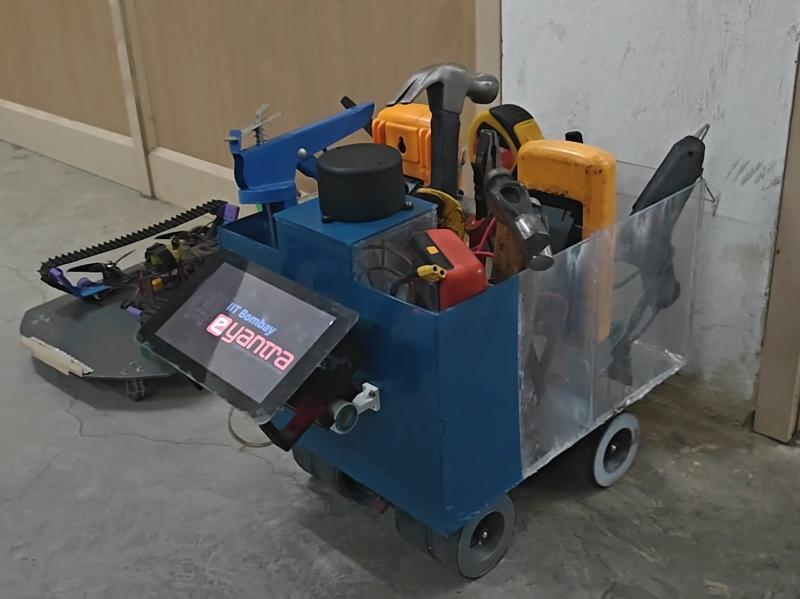

# 🛠️ Tool Assist Bot  
**Accessible Robotics for Smarter Labs**

An intelligent assistive robot built to support differently-abled individuals in laboratories by automating tool handling and material transport using autonomous navigation and smart control systems.

---

## 🌍 Social Impact

Supports:
- **SDG 4: Quality Education**  
- **SDG 10: Reduced Inequalities**

> ♿ Promotes inclusive learning and independent lab operation for users with disabilities.

---

## 🏆 Achievements

- 🏅 **Top 10 Winners – eLSI Hackathon 2024, IIT Bombay – eYantra**  
  Among 200+ teams. Developed a robotic assistant for lab automation.  
  💰 Awarded ₹5,000 ($58)

---

## ⚙️ Key Features

- 🔄 Reduced manual effort by 70% in lab tool handling  
- 🤖 Autonomous navigation using **SLAM** in ROS 2 Humble  
- 🛠️ Sensor fusion with **RP LiDAR + IMU** for precise localization  
- 🧠 A* and Dijkstra-based path planning with real-time obstacle avoidance  
- 💡 Designed in Fusion 360, tested with ANSYS R1 2024  
- 🧪 Kinematic simulation and validation in **Gazebo**

---

## 🛠️ Tech Stack

- **Fusion 360 + ANSYS R1 2024** – Mechanical design & FEA  
- **ROS 2 Humble** – Middleware for robot control  
- **Python / C++** – Core algorithm implementation  
- **Gazebo** – Simulation and performance testing  
- **Git LFS** – Managing large project files

---
